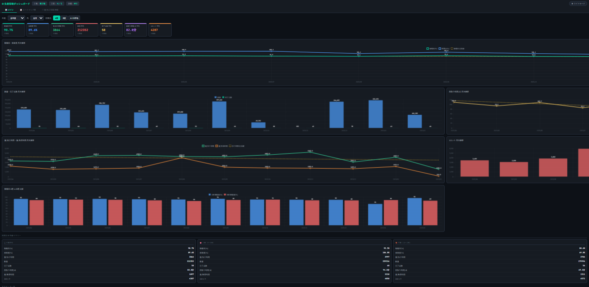

# 生産管理ダッシュボード

工場の月次生産データをブラウザ上で可視化・分析するためのオフライン対応Webアプリです。

## デモ

👉 [ダッシュボードを開く](https://persian5131.github.io/production-dashboard/production-dashboard.html)

## 背景・目的

工場の生産実績データを迅速に分析し、管理職への報告や改善提案に活用することを目的として開発しました。
データが社外に出ないよう、すべての処理をブラウザ内で完結させています。

## 使い方

1. `production-dashboard.html` をブラウザで開く
2. CSVファイルをドラッグ＆ドロップ
3. ダッシュボードが自動表示される
